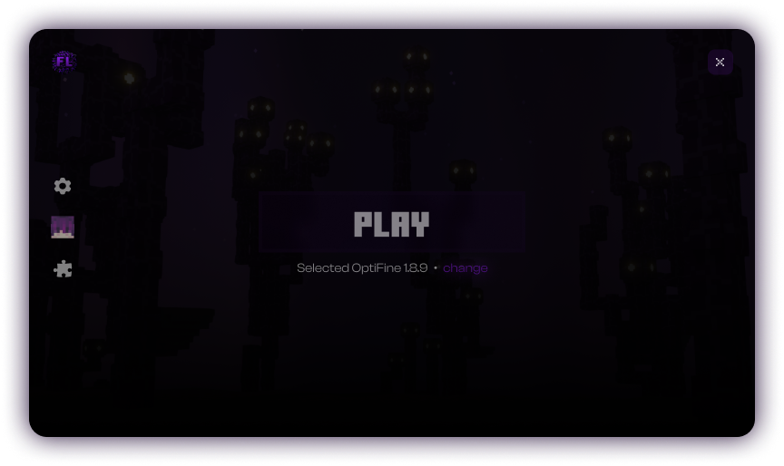

<h1 align="center"> üí´ Flexberry Launcher</h1>

An open-source and lightweight launcher for Minecraft 
<em>Flexberry Launcher is <b align="center">under development</b>, join to <a href="https://discord.gg/dbVPH8KYP2">
Discord server
</a> and check the progress</em>
  

<h1>‚ú® Features</h1>

* üîí Easy and secure account management
  * Add multiple Microsoft accounts and switch between them easily.
  * Does not stores your data.
  * Supports offline mode. `soon`
* 📂 Version control system
  * Flexberry Launcher keeps itself up-to-date all the time.
* ⚙️ Useful settings to manage launcher
  * More settings will be added `soon`
* ‚òï Automatic Java installer
  * Installs Java for Minecraft versions that needs different versions of Java.
* üé® Built in skin library to select from `soon`
* 🏗️ Mod manager to install new mods and manage installed ones  `soon`
## Configure remote instances

The launcher now understands remote instances that are served through any HTTP endpoint.  
Edit src/config/instance-server.json (or drop an override inside your user-data directory:
%APPDATA%/Flexberry Launcher/instance-server.json on Windows, ~/Library/Application Support/Flexberry Launcher/instance-server.json on macOS, ~/.config/Flexberry Launcher/instance-server.json on Linux) and set:

`json
{
  "enabled": true,
  "baseUrl": "https://launcher.yourstudio.dev",
  "instancesEndpoint": "/api/instances",
  "headers": {
    "x-api-key": "REPLACE_ME"
  }
}
`

Your endpoint must respond with an array (or { "instances": [] }) where each entry looks like:

`json
{
  "id": "fabric-lite",
  "name": "Fabric Lite",
  "description": "Lightweight Fabric pack with QoL mods.",
  "minecraftVersion": "1.20.4",
  "loader": "fabric",
  "loaderVersion": "0.15.7",
  "versionId": "fabric-lite-1.20.4",
  "downloadUrl": "https://cdn.yourstudio.dev/packs/fabric-lite.zip",
  "sha1": "1b3f4aÖ",
  "updatedAt": "2024-11-01T08:00:00.000Z"
}
`

Each archive must contain an instance.meta.json file (at the root or inside the first folder) describing how it should be installed:

`json
{
  "id": "fabric-lite",
  "versionId": "fabric-lite-1.20.4",
  "gameDirectory": ".",
  "loader": "fabric",
  "javaComponent": "jre-17",
  "type": "custom",
  "memory": { "min": 4096, "max": 6144 },
  "baseVersion": {
    "id": "1.20.4",
    "url": "https://piston-meta.mojang.com/..."
  }
}
`

Package the mods/config/assets inside the archive and include the relevant ersions/<your-version-id>/<your-version-id>.json (and .jar) folder so Forge/NeoForge/Fabric instances launch instantly. During installation the launcher copies the ersions folder into the global .Onicore/versions directory and uses lexberry-instances/<instance-id> as the game directory.

You can refresh, install, and launch remote packs directly from the new ìInstancesî tab inside the launcher UI. The launcher automatically handles downloads, checksum validation, per-instance directories, and selects the right Java runtime before launching.
## Development workflow

1. Install dependencies once: 
pm install (root) and 
pm --prefix web-server install (already done when you generated the scaffold).
2. Start everything in watch/dev mode:
   `ash
   npm run dev
   `
   This spawns:
   - nodemon ... electron . (renderer/main process in watch mode)
   - 
pm run dev inside web-server/ (Express API with hot reload)

Press Ctrl+C once to stop both processes thanks to the shared runner.
### Optional loader installers

To let the launcher fetch NeoForge directly from the official Maven instead of shipping the ersions/ folder, add a 
equiresInstaller block in instance.meta.json:

`json
"requiresInstaller": {
  "loader": "neoforge",
  "version": "21.1.213",
  "minecraftVersion": "1.21.1",
  "installerUrl": "https://maven.neoforged.net/releases/net/neoforged/neoforge/21.1.213/neoforge-21.1.213-installer.jar"
}
`

When present, the launcher downloads that installer, runs it headlessly (Java must be available on the client machine), and then continues launching your pack. If the ersions/ directory already contains the required NeoForge entry the installer step is skipped.
When that block exists you may omit the pre-built ersions/ folder from your archiveóthe launcher skips running the installer if it detects the version already installed.
## Settings quick tips

Open the Settings tab (sidebar cog) to pick the minimum and maximum RAM (in MB) that Minecraft should use. The launcher now stores those values per-user and applies them to every profile/remote pack unless the pack requires a specific allocation.
## Storage location

Flexberry Launcher now keeps every instance/extracted version under the .Onicore directory (e.g. %APPDATA%\.Onicore on Windows, ~/Library/Application Support/Onicore on macOS, ~/.Onicore on Linux). If you point packs at a relative gameDirectory, it will be resolved inside .Onicore.
- To run the packaged app locally: 
pm start
- To create distributables: 
pm run build (electron-builder)
## Selvania-style modpacks

Set package.json ? url (and optional user) to the root of your Selvania-compatible web server. The launcher fetches ${url}/launcher/config-launcher/config.json for metadata and ${url}/files for the modpack list. Each entry must describe the manifest URL, loader (forge/fabric/neoForge), JVM args, ignored files, etc. See [Selvania-Launcher](https://github.com/luuxis/Selvania-Launcher) for the exact JSON schema.

When a player hits PLAY the launcher:
1. Resolves the local game directory inside .Onicore/<dataDirectory>.
2. Uses minecraft-java-core to download/patch the files exposed at instance.url, respecting erify/ignored.
3. Installs the requested loader (Fabric/Forged/NeoForge) and launches Minecraft with the RAM limits you set in the Settings tab.

Optional 
equiresInstaller blocks still work for NeoForge: provide the Maven URL and the launcher will download/run the installer before patching.
